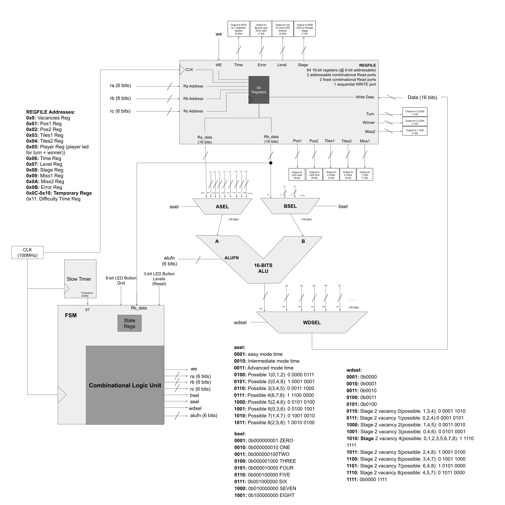
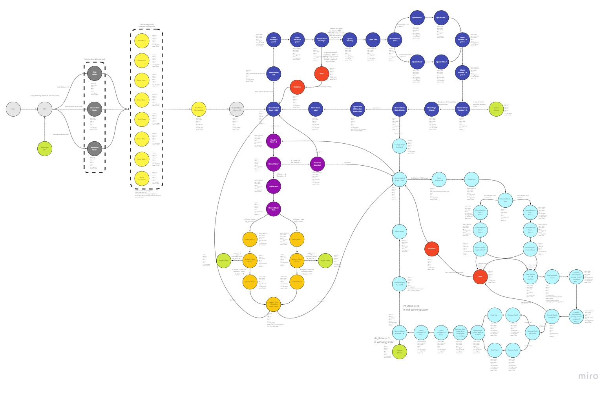

# ACHI
50.002 Computation Structures Team 2-2 1D Design project

> Tic-tac-toe, but there is never going to be a tie!

## Authors

- Kevin Ma @Kevinskwk
- Hannah Jean @jeanmah
- Shawn Goh @ShawnGoh
- Chin Wei Wen @JustANameBrooo
- Nicole Yu @nicolefranc

## Introduction

> The origin of the game Achi traces its roots back to Ghana, where it exists as a two-player abstract strategy game. It is similar in play-style to tic-tac-toe, but even more so to games like 3 men’s morris and Nine Holes as pieces change position as the game progresses, with the ultimate goal of creating a 3-in-a-row situation.

Our version of this game differs slightly from the official version of Achi in that while users have four pieces to drop. After all 8 pieces are dropped, players can take turns to move their existing pieces. In higher difficulty levels, players are even allowed to skip their turn to obtain a more strategically advantageous playing board. The experience is further enhanced as we also implemented a timer for each turn to simulate an environment similar to that of blitz chess.

We have implemented this simple but interesting game using an Alchitry Au FPGA!

## Game Play

The rules of our version of the game are simple:

### Aim:
Like in Tic-tac-toe, the goal is to achieve a 3-in-a-row situation with your pieces ahead of the other player.

### Stage 1:
- Players are to take turns to palace their allocated 4 pieces. Once all 4 pieces are used up, the game will proceed to stage 2.
- Players are not allowed to skip their turn in stage 1.
- Depending on the difficulty, the amount of time to execute each turn is different with lesser time in increasing difficulty levels(easy - No time, Intermediate - 8s, Advanced - 5s)

### Stage 2:
- Players are to take turns to move their tiles that are adjacent to the one vacant tile.
- Players are allowed to strategically skip once per game.
- Missing their turns twice would result in losing the game.

## Implementation

We implemented this game on FPGA by building a datapath. A diagram of the datapath is shown here:

### FSM

The Finite State Machine (FSM) stores all the states and corresponding signals to the other components. Essentially, the logic of the whole game is written here. Below is a snapshot of our FSM:

### Regfile

The regfile has multiple registers inside storing the variable values needed suring the game. It also gives out signals for all the io outputs.

### ALU
The Arithmetic Logic Unit (ALU) is the unit that performs all kinds of operations. Including add, shift, boolean, compare, and multiplication. In out implementation, the ALU is instantiated inside the `control.luc` module, together with asel, bsel, wdsel muxes.

## Media
- Poster: *To be uploaded*
- Video: *To be uploaded*

## In This Repository:

- `Achi`: The source code for the Achi Game we have implemented
- `ALU`: The implementation of the ALU and a testing interface (using Alchitry Io shield)
